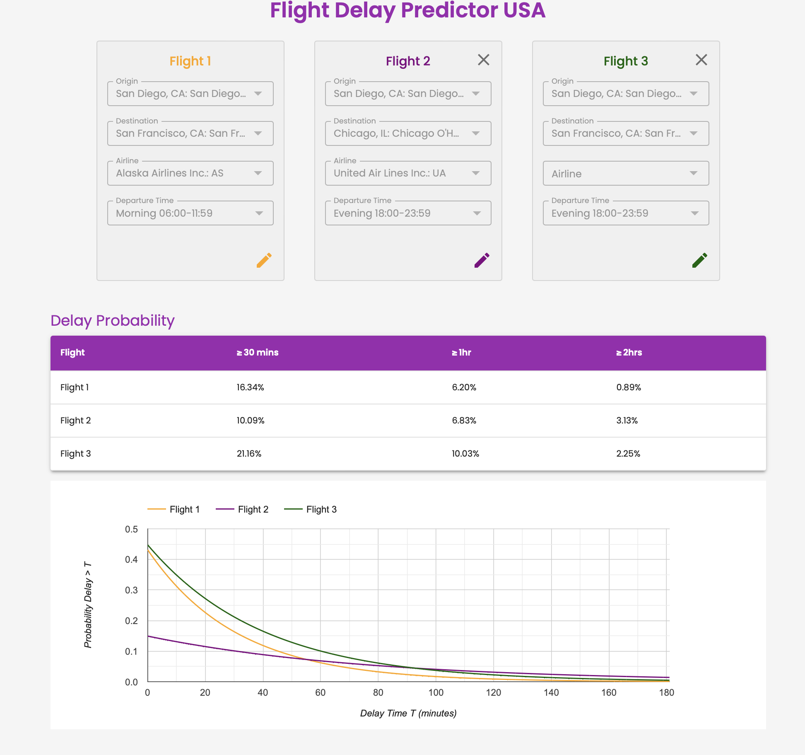

# Flight Delay Analysis
flightdelay.us

We play around with some flight delay data to analyze how it varies based on origin, destination, airline, and time of day.

Data from: https://www.transtats.bts.gov/DL_SelectFields.aspx?gnoyr_VQ=FGK&QO_fu146_anzr=b0-gvzr

Writeup on approach: [View PDF](FlightDelayPrediction.pdf)

## Data Generation
Unless you need to regenerate the data, skip this section. You can just use `cached_data.zip` directly.

To use the full dataset, you can scrape data via `data_scraper.py` - update the `YEARS` and `MONTHS` in the custom there to download what you need
and see details and caveats in the comments in that file.
Invoke with:
```
python data_scraper.py --config [full, custom, test]
```
Recommend trying `test` first to make sure it works before going for `full` or `custom`.

Move your raw data from `Downloads` folder into some desired data directory.

Then, run
```
python data_cacher.py --data_dir INSERT_DATA_DIR --output_file_path INSERT_OUTPUT_FILE_PATH
```
This will read in the raw CSV files from the scraper, prune the data, and store resulting data in another file.

## Web App
Run using `./launch.sh`. 

It allows optional user input for fields and computes the delays for `>= 30mins`, `>= 1hr`, `>= 2hrs` and plots `P(delay > T) vs T`.
The user can select which configurations for conditioning they want to see in the plot.



### Fitting Models and Generating Assets
We fit exponential distributions to model the delays conditioned on factors since we want this to be a lightweight web app. To fit these,
run:
`python flight/fit_models.py --input_data_path [INPUT_DATA_PATH] --raw_lookup_tables_dir stored_data/lookup --output_assets_dir app/backend/assets/`
Where `INPUT_DATA_PATH` is the path of the cached data (from `cached_data.zip` or a regenerated dataset).

## Analysis Notebook
See `FlightDelayAnalysis.ipynb` for some example analysis. Unzip `notebook_data.zip` to use the data referenced in the notebook in the first section.

For the second section for full data analysis, you'll need scraped data - reference `Data Generation` section or use `cached_data.zip`.
